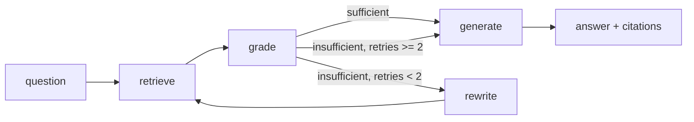

# Indian Gov Scheme RAG Assistant

*(demo GIF placeholder — recorded once the API is deployed)*

A self-correcting agentic RAG assistant over Indian government welfare scheme documentation
(PMAY, Ayushman Bharat, PM-KISAN, and state schemes), built as a LangGraph state machine with
hybrid retrieval and a measured evaluation harness.

**Corpus**: 28 official PDFs sourced from gov.in domains and official state portals (PMAY-Urban,
PMAY-Gramin, Ayushman Bharat/PM-JAY, PM-KISAN, plus Odisha and West Bengal state schemes) —
manifest with source URLs in `data/raw/manifest.json`. 24 of the 28 yielded extractable text
(1,083 pages → 2,464 chunks at 256 tokens / 1,235 chunks at 512 tokens); the other 4 are
scanned image-only PDFs with no text layer (OCR was out of scope — see "What didn't work").

## Results

*(ablation table — filled in from `eval/results/ablation.json` once the corpus and eval set are built; see `eval/run_eval.py --all`)*

| Configuration | Recall@5 | Faithfulness | p95 latency |
|---|---|---|---|
| Dense only, 512-token chunks | — | — | — |
| Dense only, 256-token chunks | — | — | — |
| Hybrid (dense + BM25) | — | — | — |
| Hybrid + cross-encoder rerank | — | — | — |
| Hybrid + rerank + agent retry | — | — | — |

## Architecture



- **retrieve**: hybrid search (dense `bge-small-en-v1.5` + BM25) fused via reciprocal rank fusion, then reranked with `cross-encoder/ms-marco-MiniLM-L-6-v2`.
- **grade**: LLM judges whether retrieved context can answer the question.
- **rewrite**: reformulates the query on failure; hard-capped at 2 retries so the loop never runs unbounded.
- **generate**: produces the answer with inline `[chunk_id]` citations, calling eligibility/comparison/lookup tools when needed, and explicitly refusing when context is insufficient.

## Design decisions

- **Chunking**: *(fill in after the ablation — 256 vs 512 token tradeoff, with the actual numbers)*
- **Hybrid over dense-only**: BM25 catches exact scheme names, section numbers, and rupee figures that embeddings blur together.
- **Reranking**: cross-encoder scores (query, chunk) pairs jointly; consistently worth double-digit recall points at the cost of latency, so it only runs over the top ~20 fused candidates.
- **Ground truth is document-level, not chunk-level**: chunk boundaries move between the 256/512-token ablation configs, so `relevant_doc_ids` in the eval set names source PDFs, not chunk IDs — the one thing that stays stable across every config being compared.
- **Retry cap = 2**: the single most common bug in agentic RAG is an unbounded grade→rewrite loop; capping it and forcing `generate` with an explicit "insufficient information" instruction is a deliberate design choice, not an oversight.

## What didn't work

- **RAGAS** (the spec's original choice for generation metrics) pulls in `scikit-network`, which requires compiling native extensions and failed to build on this machine (Windows, Python 3.14, no MSVC Build Tools installed). Rather than install a heavy C++ toolchain for one dependency, generation metrics (faithfulness, answer relevance, hallucination rate) are hand-implemented as LLM-as-judge prompts in `eval/metrics.py` — the same "write it yourself, understand it better" approach the spec already prescribes for retrieval metrics.
- **4 of 28 sourced PDFs are scanned image-only documents** with no extractable text layer (`pmkisan_kisan_credit_card_guidance`, `odisha_kalia_scheme_notification`, `pmay_gramin_rhiss_guidelines`, `pmay_urban_amendments`) — confirmed by checking that every page has 0 extracted characters despite containing an embedded image. OCR (e.g. `pytesseract`) would recover these but adds a system-level Tesseract dependency for 4 documents out of 28; left out of scope. They stay in `manifest.json` for transparency but contribute nothing to the index.
- **Ayushman Bharat/PM-JAY's official site (`nha.gov.in`) has been rebuilt as a JS single-page app** — all of its old direct PDF links now return the app shell instead of a file. Its 3 documents in the corpus were sourced from mirrors (Kerala State Health Agency, NIC's gov cloud) instead, and are hospital-operations/claims manuals rather than beneficiary-facing eligibility guidelines — which is also why PM-JAY has no hardcoded rule in `eligibility_calculator` (its real eligibility runs off SECC 2011 deprivation criteria that aren't in these documents at all, not a numeric threshold).
- *(ablation regressions added here once `eval/run_eval.py --all` has been run)*

## Setup

### Local (no Docker)
```bash
python -m venv .venv
.venv/Scripts/activate       # .venv/bin/activate on macOS/Linux
pip install -r requirements.txt
cp .env.example .env         # fill in GROQ_API_KEY
python -m src.ingestion.download_corpus   # re-download PDFs from manifest.json
python -m src.ingestion.build_index       # parse, chunk, embed, index (Qdrant local mode)
python -m eval.run_eval --all             # reproduce the ablation table
uvicorn src.api.main:app --reload
```

### Docker (deployment path, real Qdrant server)
```bash
docker compose up
```

## Limitations

- Corpus is 28 documents (24 with extractable text), short of the original 40-60 target — official PDF availability was the constraint, not effort: several official domains (`pmayg.nic.in`, `nha.gov.in`'s old link structure) are dead or JS-rendered, and a 3rd/4th state scheme's official PDFs weren't locatable. Scoped to major central schemes plus 2 state schemes, not exhaustive coverage of every Indian welfare program.
- Eligibility calculator rules are transcribed from ingested guideline PDFs at a point in time; scheme rules change, so it always cites its source chunk and falls back to raw retrieved text when no hardcoded rule exists.
- No auth, no UI, no multi-tenancy — out of scope by design, per the project spec.
- Groq free tier rate limits apply; heavy concurrent load will throttle.

## Interview prep notes

*(short answers to the "why 512 not 256", "what does BM25 catch that embeddings miss", "how do you know it isn't hallucinating", etc. questions — filled in once real ablation numbers exist to point to)*
